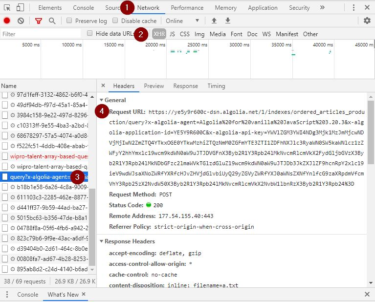

# Getting analytics data from dev.to 

## Getting the ajax URL 

- Open Chrome and go to https://dev.to/t/java
- Open the _'Developer Tools'_. Press _'CTRL + Shift + i'_ 
- Click on _'Network'_ [1] and _'XHR'_  [2]
- Scrolls the page down until new feeds be loaded
- Look for the entry _'query?x-algolia-agent'_ 
- Copy the _'Request URL'_ 



## Configuring the python script

- Open the python script
- Paste the _'Request URL'_ into the _'self.url'_ entry
- Go to the file end and change the _'tag'_ variable with the TAG you want to grab data. 
- Output: CSV files ar generated on method _'self.export_data_to_csv'_
- Optional: To record data on Mongo DB uncomment the line _'self.record_data_on_mongoDB(articles)'_ and configure the mongoDB connection

## Runing the python script

- The script is using **Python 3.7**
- You need the modules _requests, pymongo_. To install these python modules run:
```
python -m pip install requests
python -m pip install pymongo
```
- Run the script
```
python -u web_scraping.py
```

# Data Json

The published_at_int field has a numeric value that represent a date time. To convert this number to a formatted date the dev.to website use a [timeAgo funcion](https://github.com/thepracticaldev/dev.to/pull/1981/files#diff-ae46909d1fad54dcf15fe8b6d54921ea) 

The response is a json in the following format.
```json
{
  "hits": [
    {
      "title": "Which for loop?",
      "path": "/lankydandev/which-for-loop-pa1",
      "class_name": "Article",
      "comments_count": 0,
      "reading_time": 4,
      "language": "en",
      "tag_list": [
        "java",
        "beginners"
      ],
      "positive_reactions_count": 6,
      "id": 133362,
      "hotness_score": 212661,
      "score": 6,
      "readable_publish_date": "Aug 22",
      "flare_tag": null,
      "user_id": 102767,
      "organization_id": null,
      "cloudinary_video_url": null,
      "video_duration_in_minutes": "0:00",
      "experience_level_rating": 5.0,
      "experience_level_rating_distribution": 5.0,
      "published_at_int": 1484438400,
      "user": {
        "username": "lankydandev",
        "name": "Dan Newton",
        "profile_image_90": "https://res.cloudinary.com/practicaldev/image/fetch/s--JW1F599L--/c_fill,f_auto,fl_progressive,h_90,q_auto,w_90/https://thepracticaldev.s3.amazonaws.com/uploads/user/profile_image/102767/692c9882-8b83-40d9-a76b-becccad91b0b.jpg"
      },
      "organization": null,
      "_tags": [
        "java",
        "beginners",
        "user_102767",
        "username_lankydandev",
        "lang_en"
      ],
      "objectID": "articles-133362"
    }
  ],
  "nbHits": 1145,
  "page": 0,
  "nbPages": 1000,
  "hitsPerPage": 1,
  "processingTimeMS": 1,
  "exhaustiveNbHits": true,
  "query": "*",
  "params": "query=*&hitsPerPage=1&page=0&attributesToHighlight=%5B%5D&tagFilters=%5B%22java%22%5D&restrictIndices=searchables_production%2CTag_production%2Cordered_articles_production%2CClassifiedListing_production%2Cordered_articles_by_published_at_production%2Cordered_articles_by_positive_reactions_count_production%2Cordered_comments_production"
}
```


# Pagination limitation

Dev.to use Angolia as backend and Angolia has a [pagination limitation](https://www.algolia.com/doc/guides/building-search-ui/going-further/backend-search/how-to/pagination/#pagination-limitations) of 1000 hints. This value can only be [configured on backend](https://www.algolia.com/doc/api-reference/api-parameters/paginationLimitedTo/?language=python) so when you try to reach articles after this limit, you have a error message as response:

```json
{
  "hits": [],
  "page": 10,
  "nbHits": 0,
  "nbPages": 0,
  "hitsPerPage": 100,
  "exhaustiveNbHits": true,
  "processingTimeMS": 1,
  "message": "you can only fetch the 1000 hits for this query. You can extend the number of hits returned via the paginationLimitedTo index parameter or use the browse method. You can read our FAQ for more details about browsing: https://www.algolia.com/doc/faq/index-configuration/how-can-i-retrieve-all-the-records-in-my-index",
  "query": "*",
  "params": "query=*&hitsPerPage=100&page=10&attributesToHighlight=%5B%5D&tagFilters=%5B%22java%22%5D&restrictIndices=searchables_production%2CTag_production%2Cordered_articles_production%2CClassifiedListing_production%2Cordered_articles_by_published_at_production%2Cordered_articles_by_positive_reactions_count_production%2Cordered_comments_production"
}
```


